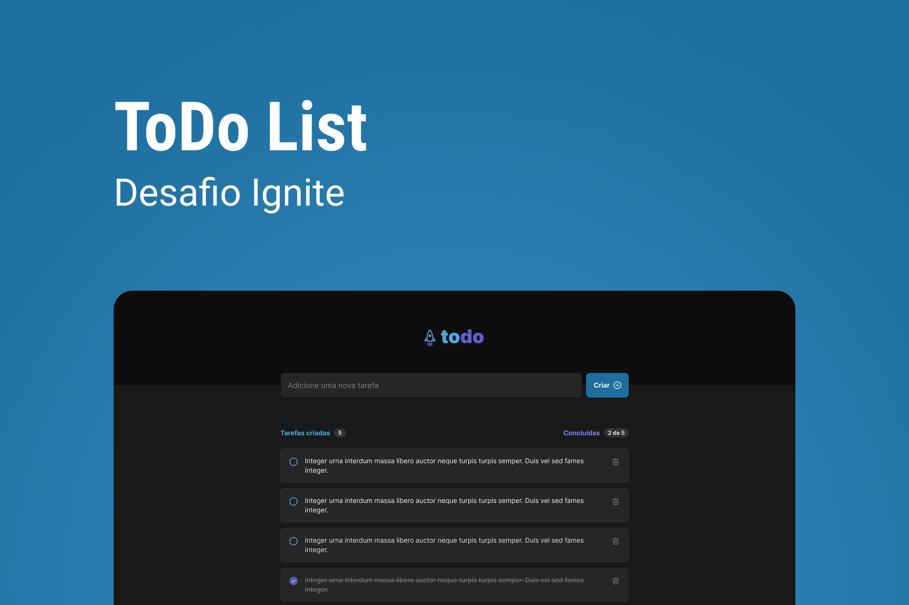

// <p align="center">
//  
// </p>
<p align="center">
  
  
  <a href="https://github.com/viieiiragui/to-do-list/blob/main/LICENSE">
  
  </a>
</p>

#

<p align="center">
  <a href="#-technologies">Technologies</a> •
  <a href="#-getting-started">Getting Started</a> • 
  <a href="#-project">Project</a> • 
  <a href="#-license">License</a>
</p>

## 🧪 Technologies

This project was developed using the following technologies:

- [Vite](https://vitejs.dev/)
- [React](https://reactjs.org)
- [Typescript](https://www.typescriptlang.org/)

## 🚀 Getting Started

Clone this project and access the folder

```bash
$ git clone https://github.com/viieiiragui/to-do-list.git && cd to-do-list
```

Follow the steps below

```bash
# Install the dependencies
$ npm install

# Start the project
$ npm run dev
```

## 💻 Project

Why a task control application? Because the tasks on a list should be goals to encourage and organize what is needed, both in personal life or at work. Contains the following functionalities:

- Add a new task
- Mark and unmark a task as complete
- Remove a task from the list
- Show task completion progress

## 📝 License

This project is licensed under the MIT License. See the [LICENSE](LICENSE) file for details.
